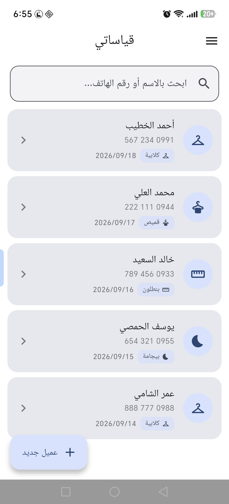
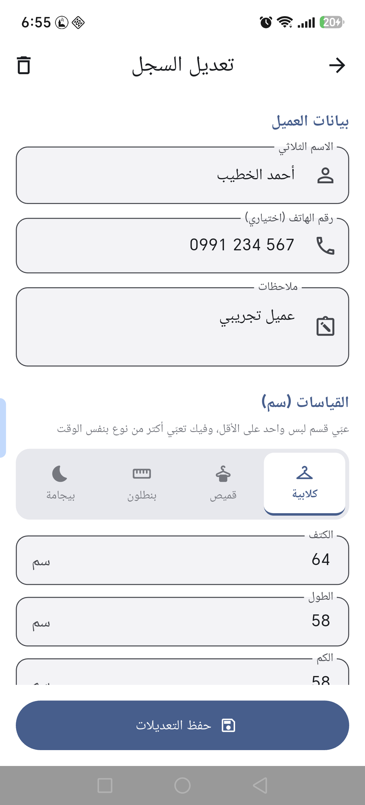
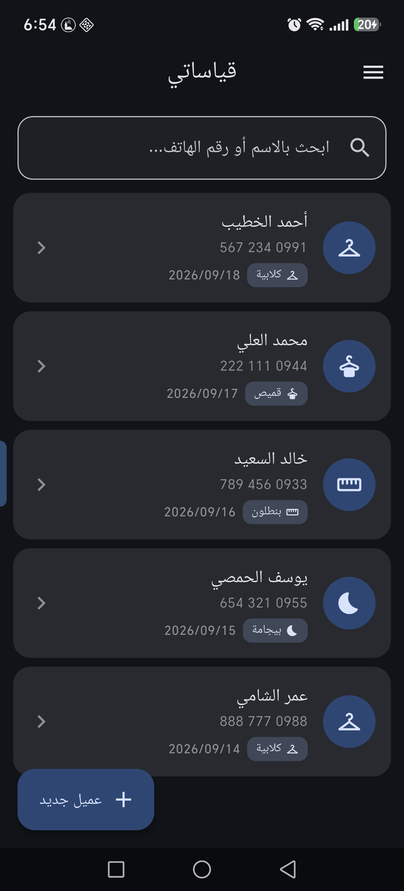

# Tailor Mate (قياساتي)

A Flutter app that helps tailors record their customers' measurements, organize them, and search them quickly. It has a full Arabic (RTL) interface and works offline.

## Screenshots

| Home | Drawer | Measurement form |
| :---: | :---: | :---: |
|  |  |  |

| Settings | Dark mode |
| :---: | :---: |
|  |  |

## Features

- Add and edit customer records with measurements per garment type.
- Quick search by name or phone number.
- Trash: soft delete with restore and undo.
- Export and import data as Excel files (duplicates are skipped on import).
- Light and dark themes.
- Side drawer with Trash, Settings, Contact us, and About.
- Local storage on the device using SQLite.

## Tech stack

- [Flutter](https://flutter.dev) with Material 3
- `sqflite` for the local database
- `shared_preferences` for theme settings
- `excel` and `file_picker` for export and import
- `url_launcher` for opening links
- `intl` and `flutter_localizations` for localization

## Project structure

```
lib/
├── data/       Database (database_helper.dart)
├── models/     Data models (measurement record, garment types)
├── screens/    Screens (home, record form, settings, trash)
├── services/   Services (Excel, theme controller)
└── main.dart   Entry point
```

## Getting started

```bash
flutter pub get
flutter run
```

## License

No license has been specified yet.


## 📥 Download the App

👉 [Download Groupify APK V1.0.0](https://github.com/huzaifakhashan/tailor-mate/releases/tag/v1.0.0)
👉 [Download Groupify APK V2.0.0](https://github.com/huzaifakhashan/tailor-mate/releases/tag/v2.0.0)
